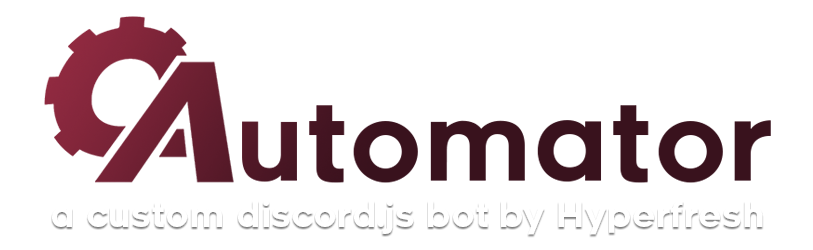

# A custom Discord bot for Calculated Anarchy that manages profile cards, invites, custom roles and more.
[Learn more about CAutomator on its website.](https://hyperfresh.github.io/CAutomator)

Built in Node.js from the ground-up from its [Python ancestor](https://github.com/hyperfresh/CAutomator-Legacy), CAutomator can control custom roles for each user to help users stand out, manage server-side profile cards to help users with IRL identity, find the time and weather across the globe, and manage invites into the server. 

## Feature spotlight: Profile system

A common problem within the Calculated Anarchy server is IRL identities. CAutomator fixes this problem with the **CAutomator Profile System**.

The CAutomator profile system is able to show the user's IRL name, pronouns, birthday, Switch friend code, pride badges and interests. It also has the ability to show the user's time and time zone, as well show a brief "about me"!

There's more features to learn about! Have a look at https://hyperfresh.github.io/CAutomator for more details.

---

*CAutomator - the custom-built Discord bot, coded in Node.*

*Copyright (C) 2021 Hyperfresh | https://github.com/Hyperfresh/CAutomator/*

*This program is free software: you can redistribute it and/or modify
it under the terms of the GNU Affero General Public License as published by
the Free Software Foundation, either version 3 of the License, or
(at your option) any later version.*

*This program is distributed in the hope that it will be useful,
but WITHOUT ANY WARRANTY; without even the implied warranty of
MERCHANTABILITY or FITNESS FOR A PARTICULAR PURPOSE.  See the
GNU Affero General Public License for more details.*
